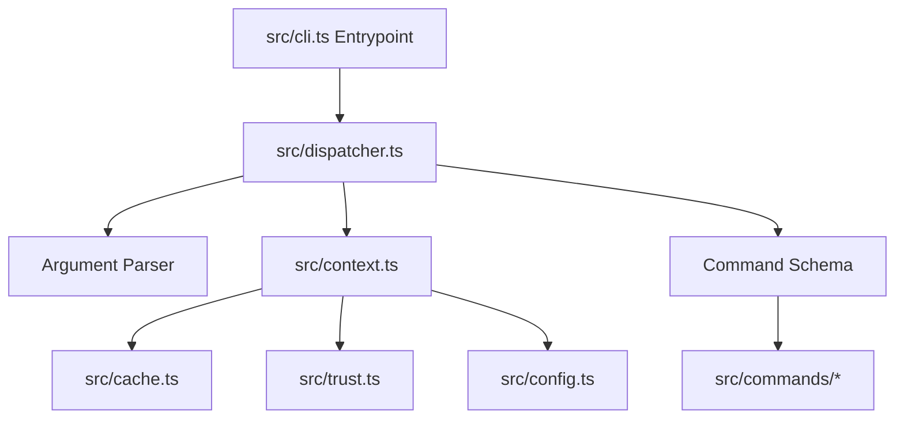

# Domain Context

## Domain Vocabulary

- **WorkspaceContext**: Consolidates workspace-level state, cache (`CacheStore`), globally resolved configuration, project config resolution, trust validation (`trust.ts`), and environment details into a single unit of orchestration.
- **Command Schema / Command**: A declarative schema specifying command metadata (name, aliases, description, usage, etc.), expected CLI flags (with type definitions, default values, short options, and requirements), and the execution handler callback.
- **Dispatcher**: The command routing engine that dynamically parses arguments according to declarative Command Schemas, resolves global options, instantiates the `WorkspaceContext`, and coordinates execution or help output.

## Architecture Layout

