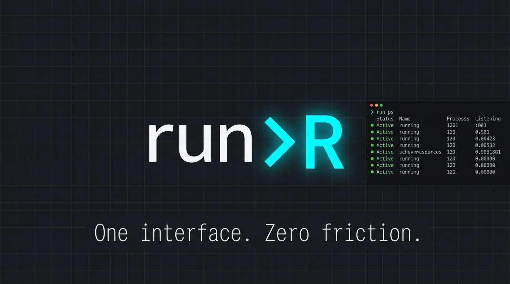

# run-cli



`run-cli` consolidates your project's command surface into a single, lightning-fast, zero-dependency launcher: `run`.

Instead of remembering whether a repository uses `bun run`, `npm run`, `poetry run`, `go run`, `cargo run`, or local makefiles/scripts, you define the project's entrypoint contracts once in a `.run.toml` and use the exact same commands everywhere.

## Core idea

`run` has one job: launch the project's command intentionally and cheaply.

- `run` executes the project's default command
- `run -p <profile>` executes a named profile
- `run -- <args...>` forwards args to the child command untouched
- `run up` manages long-running processes started by `run`
- `run doctor` explains what the CLI resolved

The current version is built around those rules. This is the canonical contract.

## High-Impact Features

- **⚡ Sub-Millisecond Startup**: Built in Bun with zero runtime dependencies. Configuration discovery and cache resolution take under `0.5ms`.
- **🔌 Unified Command Surface**: Run the default profile, named profiles, or manage background daemons using a single binary.
- **🛠️ Automated Stack Detection**: `run init` automatically scans project files, detects Node/Bun/Go/Rust/Python ecosystems, and configures optimized startup scripts.
- **🖥️ Lightweight Daemon Manager**: Run background workers with `run up` and monitor their logs, listening ports, CPU/memory metrics, and status from a live `run dashboard`.
- **🐚 Dynamic Shell Interceptors**: Map profiles and aliases directly to custom terminal commands (like `rund` or `run-d`) with tab completions and a cryptographically verified `run trust` gate.
- **🤖 AI-Agent Friendly**: Exposes clean, structured JSON diagnostics (`--json`) and doctor reports, helping AI coding assistants discover project scopes and debug issues deterministically.

## Mental model

Think about the CLI in three layers.

### 1. Project command

Plain `run` means:

```bash
run
```

That executes the effective default profile from `.run.toml`.

### 2. Profile selection

Profiles are explicit:

```bash
run -p dev
run -p worker
```

If you want a named workflow, use `-p` or `--profile`.

#### Profile Aliases and Command Suffixes

Profiles can configure custom aliases in `.run.toml`:

```toml
[profiles.dev]
command = "bun run dev.ts"
alias = "d"
```

With this configured, you can execute the profile via `run -p d`.

You can also run profiles directly by typing the alias suffix (e.g. `rund` or `run-d`):

1. **Shell completions and hooks**: Choose the integration mode that matches your workflow:

   - **Mode A: Static Tab-Completions Only (Recommended for zero overhead)**
     Registers autocomplete for subcommands, options, and profile names, but does not hook into directory changes or create shortcut commands:

     ```bash
     # For Zsh
     if command -v run >/dev/null 2>&1; then
       eval "$(run completion zsh)"
     fi
     
     # For Bash
     if command -v run >/dev/null 2>&1; then
       eval "$(run completion bash)"
     fi
     ```

   - **Mode B: Dynamic Shell Hook (Autocomplete + Command Shortcuts)**
     Registers completions AND hooks into directory changes (`cd`), dynamically defining custom shortcut commands (like `rund`, `run-d`, or `run-worker`) based on your nearest config:

     ```bash
     # For Zsh
     if command -v run >/dev/null 2>&1; then
       eval "$(run completion --shell-hook zsh)"
     fi
     
     # For Bash
     if command -v run >/dev/null 2>&1; then
       eval "$(run completion --shell-hook bash)"
     fi
     ```

     *Security Note:* Because shell hooks dynamically evaluate `.run.toml` configurations, `run` implements a secure trust gate. When entering a new project, you must explicitly approve the config by running `run trust` before shortcuts activate.

2. **Explicit Symlinks:** If you don't want shell hooks but still want custom command aliases, create a symlink in your `PATH` pointing to the `run` command:

   ```bash
   ln -s $(which run) ~/bin/rund
   ```

   The CLI resolves the calling executable name (`rund` -> suffix `d`), maps it to the `dev` profile, and executes it.

### 3. Child arguments

By default, any arguments or flags that do not conflict with `run`'s built-in options (like `-p`, `--dry-run`, `--cwd`, `--config`, etc.) are automatically forwarded to the child command. You do not need to prefix them with `--`.

Example (forwarded automatically):

```bash
run --port 3000
run -p dev --watch --host 0.0.0.0
```

However, if you want to pass an argument or flag that conflicts with a built-in `run` command or option (like `--help`, `-p`, `doctor`, or `logs`), you must separate it with `--`:

```bash
run -- --help
run -p dev -- -p
run -- doctor
```

Rule of thumb:

- Flags/arguments that do not conflict are forwarded automatically.
- For conflicting keywords (like `doctor` or `--help`), anything after `--` goes to the child command untouched.

## Why it exists

Most repos already have a real entrypoint, but the entrypoint is hidden behind ecosystem-specific commands and local habits.

`run-cli` makes that entrypoint explicit and versioned.

It is intentionally:

- lightweight: Bun runtime, no runtime deps, cheap local state
- explicit: profiles are named, config is local, no magic env activation
- deterministic: dry-run, doctor output, and managed process metadata all come from the same resolved command path
- agent-friendly: the tool exposes stable human and machine-readable diagnostics

## Install

Prerequisite: Bun `>= 1.3.9`

```bash
bun add -g @kitsunekode/run-cli
```

You can also install with npm if Bun is already available on your `PATH` at runtime:

```bash
npm install -g @kitsunekode/run-cli
```

That exposes:

- `run`

### Install from source

```bash
bun install
bun run build
bun link
```

Refresh the global link after local updates:

```bash
bun run relink:global
```

## Release Workflow

- Add a changeset with `bun run changeset` for user-facing or release-worthy changes.
- Work from short-lived branches and merge to `main`.
- `.github/workflows/version-packages.yml` opens or updates a `Version Packages` PR from merged changesets.
- Merging the version PR updates `package.json` and changelog entries for the next release.
- `CI` runs on pull requests and `main`, and its workflow summary records the exact package version it validated.
- `Release` runs on pushes to `main` and manual dispatch. It publishes the exact `package.json` version of `@kitsunekode/run-cli` through npm trusted publishing and creates a GitHub release tagged `vX.Y.Z`.
- For a brand-new package, do one manual bootstrap publish first so the npm package settings page exists and you can attach the trusted publisher to `release.yml`.

## Quickstart

Inside a project:

```bash
run init
run
run -p dev
run -- --watch
```

Minimal config example (single default command):

```toml
version = 1
command = "bun run index.ts"
```

Minimal config example (with named profiles):

```toml
version = 1
default_profile = "default"

[profiles.default]
command = "bun run index.ts"

[profiles.dev]
command = "bun --hot index.ts"
alias = "d"
```

## How to use it day to day

### Run the project

```bash
run
```

### Run a named workflow

```bash
run -p dev
run -p worker
```

### Pass child arguments

```bash
run -- --watch
run -p dev -- --port 3000
run -- inspect
```

### See exactly what would run

```bash
run --dry-run
run -p dev --dry-run
run -- --watch --dry-run
```

### Ask the CLI what it resolved

```bash
run doctor
run doctor --json
run config validate
```

### Manage a background process

```bash
run up
run up -p worker -- --port 4000
run ps
run ps --details
run dashboard
run inspect my-app:worker
run logs my-app:worker --follow
run ports
run stop my-app:worker
run restart my-app:worker
run prune
```

## CLI overview

```text
run [args...] [-p <profile>] [-v] [--dry-run] [--no-cache] [--config <path>] [--cwd <path>]
run init [--force] [--yes] [--command <cmd>] [--default-profile <name>] [--add-profile <name=command>]
run completion <zsh|bash>
run doctor [--json]
run profiles [--json]
run up [args...] [-p <profile>] [--name <name>]
run ps [--json] [--details] [--watch]
run dashboard
run inspect <name|id> [--json]
run logs <name|id> [--lines <n>] [--follow]
run stop <name|id> | --all
run restart <name|id> | --all
run kill <name|id> | --all
run prune [--json] [--dry-run]
run ports [--json]
run config <view|path|edit|validate> [--global]
run help
```

## First-party commands vs child args

These are built into `run`:

- `init`
- `completion`
- `doctor`
- `profiles`
- `up`
- `ps`
- `dashboard`
- `inspect`
- `logs`
- `stop`
- `restart`
- `kill`
- `prune`
- `ports`
- `config`
- `help`

If you want the underlying project command to receive one of those words as an argument, use `--`:

```bash
run -- doctor
run -- inspect
run -p dev -- ports
```

## Project config

The canonical project config file is:

- `.run.toml`

Legacy support still exists for:

- `.run.config.toml`

But `.run.toml` is the real contract and the file you should create, commit, and document.

`run` walks upward from the current directory and uses the nearest project config only.

That means:

- monorepo packages can own their own run config
- repo roots can still provide a shared default
- ancestor configs are not merged

## Example `.run.toml`

```toml
version = 1
default_profile = "dev"

[profiles.default]
command = "bun run src/index.ts"

[profiles.dev]
command = "bun --hot src/index.ts"
description = "local development server"

[profiles.worker]
command = "bun run src/worker.ts"
cwd = "services/worker"

[profiles.worker.env]
QUEUE_NAME = "jobs"
DEBUG = true
```

## Output model

The CLI tries to stay polished without becoming noisy.

- default execution prints a compact startup banner
- `--verbose` / `-v` adds resolution details like profile, cwd, config path, and cache state
- `--dry-run` prints the exact shell command
- `run doctor` is the readable diagnostic report
- `run doctor --json` is the machine-readable diagnostic report

### `doctor --json` shape

`run doctor --json` currently returns:

- `cwd`: current effective working directory
- `configLookup`: resolved config metadata or `null`
- `globalConfigPath`: global config path
- `cacheFilePath`: cache file path
- `shell`: effective shell
- `cacheEnabled`: whether cache is enabled
- `detectedProject`: detected project metadata or `null`

`configLookup`, when present, contains:

- `sourcePath`
- `cacheHit`
- `legacy`

`detectedProject`, when present, contains:

- `root`
- `markers`
- `cacheHit`
- `suggestions`

## Managed processes

`run up` stores a lightweight registry for processes it starts itself.

Managed process metadata includes:

- project name
- profile
- full resolved command
- forwarded args
- pid
- cwd
- config path
- log path
- restart count

Performance behavior is intentional:

- `run ps` shows memory usage by default with color-coded status (green=running, yellow=stopped, red=exited)
- `run ps --watch` live-refreshes the process list every 2 seconds
- `run ps --details` adds port information alongside metrics
- `run inspect` and `run ports` opt into more detailed process information
- `run prune` removes dead (exited/stopped) processes from the registry and cleans up their log files
- Memory thresholds warn at 512MB (yellow) and 1GB (red) in the MEM column

This keeps the common path fast and low-overhead.

## Diagnostics and debugging

Use these when something feels off:

```bash
run doctor
run doctor --json
run config path
run config view
run config validate
run --dry-run
```

Typical workflow:

1. `run config path` to confirm which config is active
2. `run config validate` to confirm it parses
3. `run --dry-run` to see the final command
4. `run doctor` if you need the full resolution story

## Shell completion

Generate completion scripts from the CLI:

```bash
mkdir -p ~/.config/zsh/completions
run completion zsh > ~/.config/zsh/completions/_run
run completion bash > ~/.config/bash/run.bash
```

For Zsh:

```bash
fpath=(~/.config/zsh/completions $fpath)
autoload -Uz compinit
compinit
```

Checked-in loader scripts also exist in:

- `completions/run.zsh`
- `completions/run.bash`

## Global config

Global defaults live at:

- `$XDG_CONFIG_HOME/run/config.toml`
- fallback: `~/.config/run/config.toml`

Global config is intentionally limited to defaults such as:

- `shell`
- `editor`
- `cache`
- `detection`

It does not define project commands or project profiles.

Example:

```toml
version = 1
shell = "/bin/zsh"
editor = "code -w"
cache = true
detection = "suggest"
```

## Caching

Cache data is written to:

- `$XDG_CACHE_HOME/run/cache.json`
- fallback: `~/.cache/run/cache.json`

The cache stores cheap metadata such as:

- resolved config paths for known working directories
- detection results for known project roots

Use `--no-cache` to bypass cache reads and writes.

## Ecosystem examples

### Bun / TypeScript

```toml
version = 1
default_profile = "dev"

[profiles.default]
command = "bun run src/index.ts"

[profiles.dev]
command = "bun --hot src/index.ts"
```

### Node / JavaScript

```toml
version = 1
command = "node index.js"
```

### Python

```toml
version = 1

[profiles.default]
command = "python exp.py"

[profiles.dev]
command = "python -m uvicorn app:app --reload"
```

If project-native tooling is present, `run init` prefers explicit commands like:

- `uv run python main.py`
- `pipenv run python main.py`
- `poetry run python main.py`
- `.venv/bin/python main.py`

### Go

```toml
version = 1
command = "go run ."
```

## Contributing and docs

Useful repo docs:

- `docs/config-reference.md`
- `docs/architecture.md`
- `docs/contributing.md`
- `AGENTS.md`

Local quality workflow:

```bash
bun run format
bun run lint
bun test
bun run build
```

## Current scope

- Bun is required to run the CLI
- v1 targets macOS and Linux shell behavior
- Windows support is intentionally deferred
